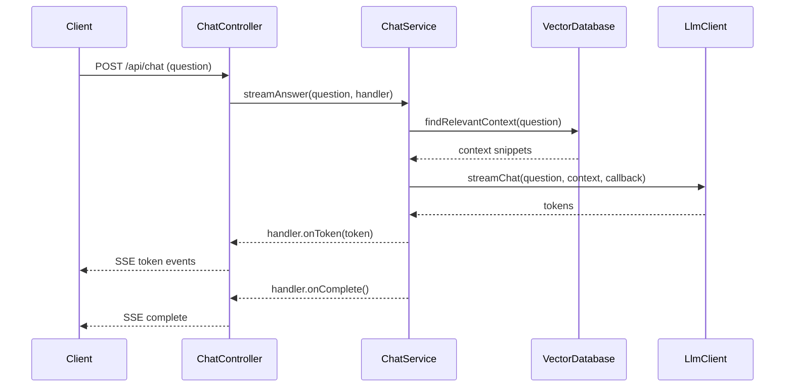

# ki_raumplanung

```
OPENAI_API_KEY=sk-proj-... jbang ingest_data.java  data/VP_Berichte
```

```
# Open a shell inside the Postgres container (optional helper)
docker compose exec pgvector bash

# Inside the container: dump data-only SQL with INSERT statements
pg_dump -U gretl --schema=arp_rag_vp --data-only --inserts arp_rag > /tmp/rag_inserts.sql

# Exit the container when done
exit

# Copy the dump file back to the host
docker compose cp pgvector:/tmp/rag_inserts.sql ./rag_inserts.sql
```

## Chat architecture



### Component responsibilities

- **`ChatController`** handles incoming REST requests, creates a dedicated `SseEmitter`, and streams the generated tokens back to the caller over Server-Sent Events.【F:src/main/java/ch/so/arp/rag/chat/ChatController.java†L25-L56】
- **`ChatService`** orchestrates the interaction between the vector store and LLM, executes the work asynchronously, and ensures streaming callbacks reach the controller through the provided handler.【F:src/main/java/ch/so/arp/rag/chat/ChatService.java†L18-L46】
- **`VectorDatabase`**, with `MockVectorDatabase` and `PostgresVectorDatabase` implementations, provides context retrieval either from an in-memory stub for tests or from the PostgreSQL/pgvector store in production.【F:src/main/java/ch/so/arp/rag/chat/VectorDatabase.java†L5-L17】【F:src/main/java/ch/so/arp/rag/chat/MockVectorDatabase.java†L5-L16】【F:src/main/java/ch/so/arp/rag/chat/PostgresVectorDatabase.java†L9-L42】
- **`LlmClient`**, implemented by `MockLlmClient` and `OpenAiLlmClient`, streams model responses either from a deterministic mock or from the real OpenAI API depending on configuration.【F:src/main/java/ch/so/arp/rag/chat/LlmClient.java†L6-L18】【F:src/main/java/ch/so/arp/rag/chat/MockLlmClient.java†L7-L32】【F:src/main/java/ch/so/arp/rag/chat/OpenAiLlmClient.java†L13-L64】
- **`SseEmitterFactory`** and its default implementation encapsulate emitter creation so controller tests can inject fakes.【F:src/main/java/ch/so/arp/rag/chat/SseEmitterFactory.java†L5-L17】【F:src/main/java/ch/so/arp/rag/chat/DefaultSseEmitterFactory.java†L5-L21】
- **`ChatConfiguration`** wires the components together and toggles between real and mock infrastructure via Spring Boot properties, including provisioning the executor used by the service.【F:src/main/java/ch/so/arp/rag/chat/ChatConfiguration.java†L19-L49】

### Why an executor is used

The `ChatService` delegates its work to a dedicated executor (`Executors.newVirtualThreadPerTaskExecutor()`) so that SSE responses can start streaming immediately without blocking the servlet thread. Each chat request obtains its own task and `SseEmitter`, allowing multiple clients to issue questions concurrently while their responses are produced on independent virtual threads and sent back through the correct emitter instance.【F:src/main/java/ch/so/arp/rag/chat/ChatService.java†L27-L43】 【F:src/main/java/ch/so/arp/rag/chat/ChatConfiguration.java†L21-L24】
