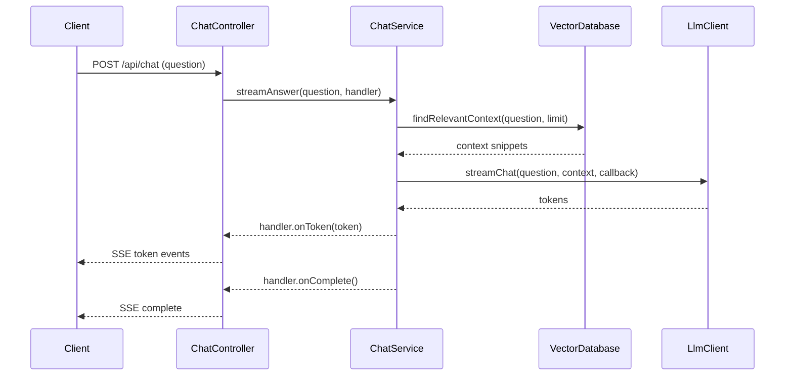

# ki_raumplanung

```
OPENAI_API_KEY=sk-proj-... jbang ingest_data.java  data/VP_Berichte
```

```
# Open a shell inside the Postgres container (optional helper)
docker compose exec pgvector bash

# Inside the container: dump data-only SQL with INSERT statements
pg_dump -U gretl --schema=arp_rag_vp --data-only --inserts arp_rag > /tmp/rag_inserts.sql

# Exit the container when done
exit

# Copy the dump file back to the host
docker compose cp pgvector:/tmp/rag_inserts.sql ./rag_inserts.sql
```

## Chat architecture



### Component responsibilities

- **`ChatController`** handles incoming REST requests, creates a dedicated `SseEmitter`, and streams the generated tokens back to the caller over Server-Sent Events.【F:src/main/java/ch/so/arp/rag/chat/ChatController.java†L25-L56】
- **`ChatService`** orchestrates the interaction between the vector store and LLM, executes the work asynchronously, and ensures streaming callbacks reach the controller through the provided handler.【F:src/main/java/ch/so/arp/rag/chat/ChatService.java†L18-L46】
- **`VectorDatabase`**, with `MockVectorDatabase` and `PostgresVectorDatabase` implementations, provides context retrieval either from an in-memory stub for tests or from the PostgreSQL/pgvector store in production.【F:src/main/java/ch/so/arp/rag/chat/VectorDatabase.java†L5-L17】【F:src/main/java/ch/so/arp/rag/chat/MockVectorDatabase.java†L5-L16】【F:src/main/java/ch/so/arp/rag/chat/PostgresVectorDatabase.java†L9-L42】
- **`LlmClient`**, implemented by `MockLlmClient` and `OpenAiLlmClient`, streams model responses either from a deterministic mock or from the real OpenAI API depending on configuration.【F:src/main/java/ch/so/arp/rag/chat/LlmClient.java†L6-L18】【F:src/main/java/ch/so/arp/rag/chat/MockLlmClient.java†L7-L32】【F:src/main/java/ch/so/arp/rag/chat/OpenAiLlmClient.java†L13-L64】
- **`SseEmitterFactory`** and its default implementation encapsulate emitter creation so controller tests can inject fakes.【F:src/main/java/ch/so/arp/rag/chat/SseEmitterFactory.java†L5-L17】【F:src/main/java/ch/so/arp/rag/chat/DefaultSseEmitterFactory.java†L5-L21】
- **`ChatConfiguration`** wires the components together and toggles between real and mock infrastructure via Spring Boot properties, including provisioning the executor used by the service.【F:src/main/java/ch/so/arp/rag/chat/ChatConfiguration.java†L19-L49】

### Retrieval pipeline

When the `PostgresVectorDatabase` is active the hybrid retrieval pipeline executes three phases before handing the best matches to the LLM:

1. **Database search** – run the tuned lexical SQL query that emphasises German term OR-combinations alongside a semantic pgvector similarity search to gather rich candidates for the user question.【F:src/main/java/ch/so/arp/rag/chat/PostgresVectorDatabase.java†L28-L87】【F:src/main/java/ch/so/arp/rag/chat/PostgresVectorDatabase.java†L107-L121】
2. **Reciprocal Rank Fusion (RRF)** – merge lexical and semantic result lists while rewarding items that rank highly in either list so that nuanced semantic matches can surface even if they are lexically sparse.【F:src/main/java/ch/so/arp/rag/chat/PostgresVectorDatabase.java†L123-L152】
3. **Cross-encoder reranking** – rescore the fused candidates using the configured cross encoder and emit the highest scoring contexts to the chat service. The cross encoder jointly inspects the question and each candidate passage so it can reward nuanced semantic alignments and penalise false positives that slipped through the coarse vector search, improving precision for the final snippets we hand to the LLM.【F:src/main/java/ch/so/arp/rag/chat/PostgresVectorDatabase.java†L110-L121】【F:src/main/java/ch/so/arp/rag/chat/PostgresVectorDatabase.java†L154-L195】

### Why an executor is used

The `ChatService` delegates its work to a dedicated executor (`Executors.newVirtualThreadPerTaskExecutor()`) so that SSE responses can start streaming immediately without blocking the servlet thread. Each chat request obtains its own task and `SseEmitter`, allowing multiple clients to issue questions concurrently while their responses are produced on independent virtual threads and sent back through the correct emitter instance.【F:src/main/java/ch/so/arp/rag/chat/ChatService.java†L27-L43】 【F:src/main/java/ch/so/arp/rag/chat/ChatConfiguration.java†L21-L24】
